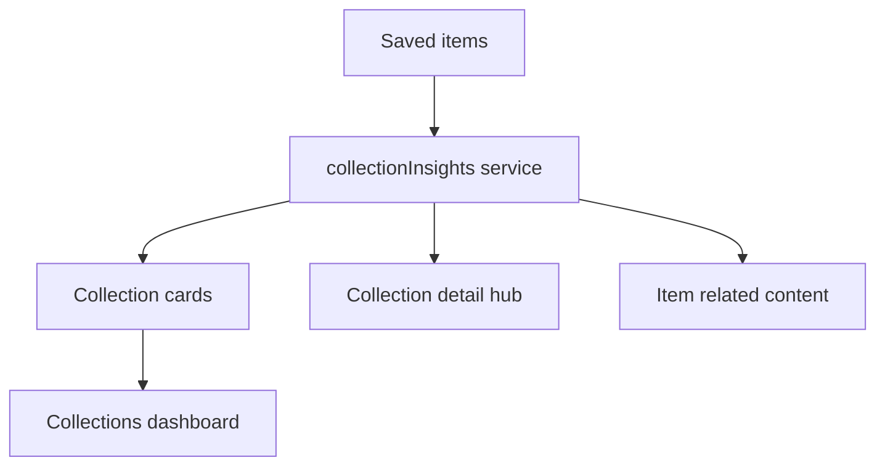

# Collection Knowledge Hubs

## Architecture proposal

Collection intelligence is derived locally from the existing `SavedItem` fields; no AI generation, provider, or database schema was changed.



[`src/services/collectionInsights.ts`](../src/services/collectionInsights.ts) builds a consistent insight model using:

- categories and source detection
- tags, preferring translated tags when available
- AI/translated summaries and titles for related-content similarity
- locations from saved addresses
- creation dates for recency, health, review suggestions, and timeline

The collection tab loads the unfiltered saved-item set so every card represents its full collection, independent of the global Home-tab filters.

## Wireframes

### Collections dashboard

```text
Collections                                      + New Collection

┌────────────────────────────────────────────────────────────┐
│ 📈  Investing                                      ›        │
│     12 items                                                 │
│                                                            │
│     Top topic     dividend                                  │
│     Top source    YouTube                                   │
│     Updated       2 hours ago                               │
│                                                            │
│     ● Growing                              Review: 3 items │
└────────────────────────────────────────────────────────────┘

┌────────────────────────────────────────────────────────────┐
│ 🏠  Real Estate                                   ›         │
│     0 items                                                  │
│                                                            │
│     ✨ Suggested content: Real Estate                       │
└────────────────────────────────────────────────────────────┘
```

### Collection detail hub

```text
‹ Back                                      Delete

[icon] Investing
       12 items

COLLECTION SUMMARY
This collection focuses on dividend investing and finance content.

Top category   Finance          Top source     YouTube
Last saved     2 hours ago      Added in 30d   5

TOP TOPICS
#dividend · 7    #portfolio · 4    #stocks · 3

REVIEW SUGGESTED
Dividend strategy overview                         ›
Saved 34 days ago

SAVED KNOWLEDGE
[ Search title, tags, summary, category, source ]
Today
[ saved-item card ]
```

## Screenshots

No device or emulator was connected when the implementation was validated, so runtime screenshots cannot be captured in this workspace. The wireframes above document the implemented UI composition. To capture screenshots, run the app with an Android/iOS simulator or a connected device and open the Collections tab plus an individual collection.

## Files changed

- [`app/(tabs)/collections.tsx`](../app/(tabs)/collections.tsx): loads collection-wide items and renders enriched cards.
- [`src/components/CollectionCard.tsx`](../src/components/CollectionCard.tsx): dashboard card with topic, source, recency, review count, health, and empty-state suggestion.
- [`src/services/collectionInsights.ts`](../src/services/collectionInsights.ts): local insight aggregation, health calculation, collection search, and related-content scoring.
- [`app/collection/[id].tsx`](../app/collection/[id].tsx): collection detail Knowledge Hub dashboard, review queue, timeline, and in-collection search.
- [`app/item/[id].tsx`](../app/item/[id].tsx): Related Content section.
- [`__tests__/services/collectionInsights.test.ts`](../__tests__/services/collectionInsights.test.ts): aggregation, health, related-content, and search coverage.

## Validation

- `npm run typecheck` passed.
- `npx jest __tests__/services/collectionInsights.test.ts --runInBand --forceExit` passed (4 tests).
- `git diff --check` passed.
- Full lint remains blocked by a pre-existing error in `__tests__/services/languageDetection.test.ts` (`@typescript-eslint/no-var-requires`), outside this feature.
